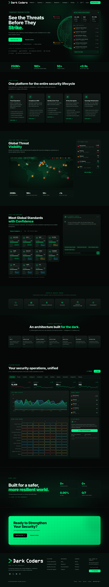
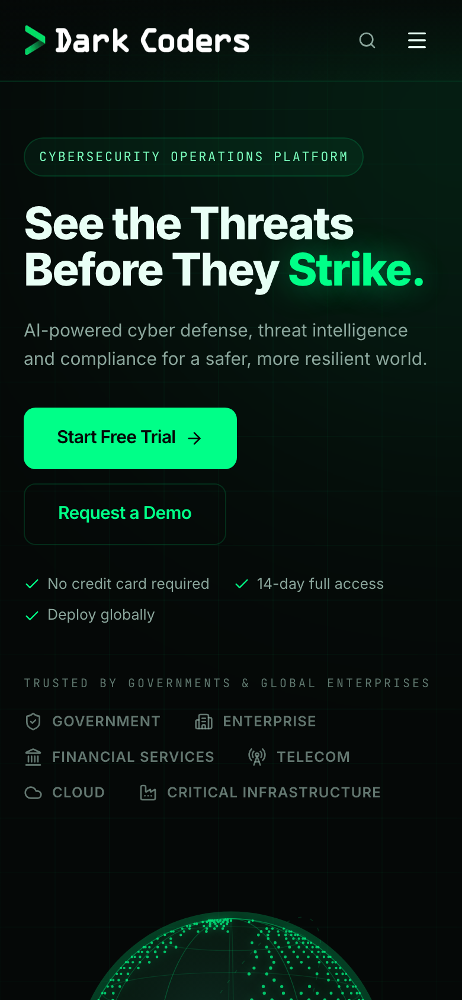

# Dark Coders — Cybersecurity Operations Platform

> **Hunt In The Darkness!**

Production-grade marketing and interactive platform-preview website for **Dark Coders**,
a global cybersecurity operations platform covering threat intelligence, SOC, SIEM, SOAR,
GRC, compliance, Zero Trust, IAM, AI security, incident response, sovereign
infrastructure and security research.

Built with **Next.js 16 (App Router) · React 19 · TypeScript · Tailwind CSS v4 ·
Framer Motion · Recharts · Zod · Lucide**.

---

## Quick start

```bash
git clone https://github.com/eimnir-wq/darkcoders.git
cd darkcoders

nvm use            # Node 22.23.2 (see .nvmrc)
npm ci             # install from the lockfile
cp .env.example .env.local

npm run dev        # → http://localhost:5555
```

The application **always runs on port 5555** (`dev` and `start` are pinned with `-p 5555`).

Health check: <http://localhost:5555/api/health> → `{"status":"ok", ...}`

### Scripts

| Command | Description |
| --- | --- |
| `npm run dev` | Development server on port 5555 |
| `npm run build` | Production build |
| `npm run start` | Production server on port 5555 |
| `npm run lint` | ESLint (Next.js core-web-vitals + TypeScript) |
| `npm run typecheck` | TypeScript project check (`tsc --noEmit`) |

> There is no `test` script — the project ships no automated test suite.
> See [`docs/TESTING.md`](docs/TESTING.md) and [`docs/QA-REPORT.md`](docs/QA-REPORT.md).

---

## What this is

A single-page site with one API route, presenting:

- Enterprise cybersecurity positioning (Threat Intelligence, SOC, SIEM, SOAR, GRC,
  Compliance, Zero Trust, IAM, AI Security, Incident Response, Sovereign Infrastructure)
- A live-looking threat intelligence panel backed by **deterministic simulated data**
- A rotating 3D dot-matrix threat globe (custom SVG orthographic projection)
- A global threat map built from **real Natural Earth geographic data**
- A compliance framework grid (11 frameworks) + an **AI Security Copilot**
- An interactive **11-tab security operations dashboard** with charts and a MITRE ATT&CK heatmap
- **13-language internationalization** including full **RTL Arabic** support

---

## Documentation

Full engineering documentation lives in [`docs/`](docs/INDEX.md):

| Document | Purpose |
| --- | --- |
| [docs/INDEX.md](docs/INDEX.md) | Documentation index (start here) |
| [docs/INSTALLATION.md](docs/INSTALLATION.md) | Install and run on a fresh machine |
| [docs/ARCHITECTURE.md](docs/ARCHITECTURE.md) | Architecture, layering, data flow |
| [docs/TECHNOLOGY-STACK.md](docs/TECHNOLOGY-STACK.md) | Exact versions used |
| [docs/DEVELOPMENT.md](docs/DEVELOPMENT.md) | Local workflow and conventions |
| [docs/PROJECT-STRUCTURE.md](docs/PROJECT-STRUCTURE.md) | Annotated repository layout |
| [docs/DESIGN-SYSTEM.md](docs/DESIGN-SYSTEM.md) | Tokens, typography, components |
| [docs/COMPONENT-CATALOG.md](docs/COMPONENT-CATALOG.md) | Component reference |
| [docs/I18N.md](docs/I18N.md) | Localization and RTL |
| [docs/RESPONSIVE.md](docs/RESPONSIVE.md) | Breakpoints and responsive behaviour |
| [docs/SECURITY.md](docs/SECURITY.md) | Implemented security controls |
| [docs/DEPLOYMENT.md](docs/DEPLOYMENT.md) | Node + Docker deployment |
| [docs/QA-REPORT.md](docs/QA-REPORT.md) | QA results |
| [docs/HANDOVER.md](docs/HANDOVER.md) | Working / partial / not implemented |
| [docs/TODO.md](docs/TODO.md) | Remaining work |

---

## Screenshots

| Desktop | Mobile |
| --- | --- |
|  |  |

More in [`docs/screenshots/`](docs/screenshots/) (desktop · tablet · mobile).

---

## Environment

Copy `.env.example` → `.env.local`. **No secret is required to run the site** — every
external integration falls back to a deterministic local mock service.

Key variables: `NEXT_PUBLIC_SITE_URL`, `PORT`. Optional integration variables
(`DATABASE_URL`, `AUTH_*`, `SIEM_*`, `SOAR_*`, `THREAT_FEED_API_KEY`, `MINIO_*`,
`AI_PROVIDER_*`, `RATE_LIMIT_*`) are documented in the template and are all empty by
design. See [`docs/DEVELOPMENT.md`](docs/DEVELOPMENT.md).

---

## Docker

```bash
docker compose up --build      # → http://localhost:5555
```

`Dockerfile` (multi-stage, port 5555, healthcheck) and `docker-compose.yml` are provided.
> The image has **not** been executed in CI — validate it in your environment.

---

## Status

| Gate | Result |
| --- | --- |
| Lint | PASS |
| Typecheck | PASS |
| Production build | PASS |
| Dev + production server (5555) | PASS |
| `/api/health` | PASS |
| Automated tests | NOT PRESENT (none exist) |
| Docker | Files present, not executed |

Full detail: [`docs/QA-REPORT.md`](docs/QA-REPORT.md) · [`docs/HANDOVER.md`](docs/HANDOVER.md).

---

## License

Proprietary — © 2024 DarkCoders. All rights reserved.
